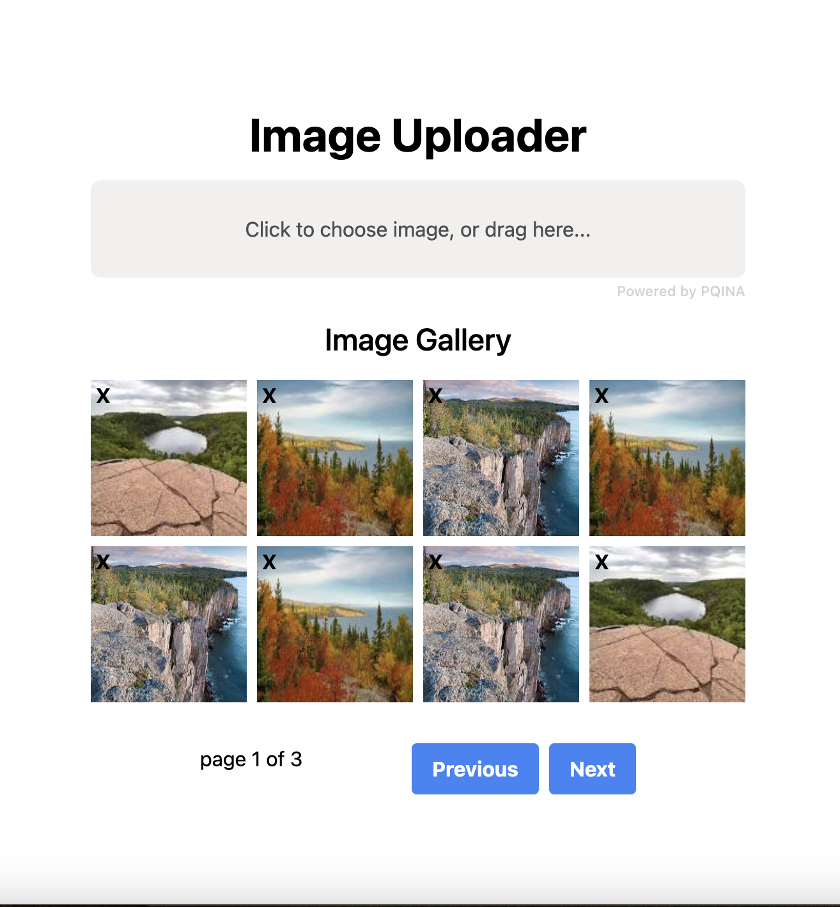

Based on laracast "Advanced image uploading with vue and laravel". Uploads image files and displays them.

## Local start:

1. npm install
2. in two seperate terminals run: 
   1. php artisan serve
   2. npm run dev
3. navigate to http://127.0.0.1:8000

## Technology Used:

1. Laravel
2. Vue
3. Mysql
4. Filepond ( https://pqina.nl/filepond/docs/getting-started/ )

## Features:

1. connects to a mysql database
2. upload images ( png, jpeg, etc)
3. view all images uploaded

## Things to Improve or Todo:

1. pagination in the gallery view

## Resources:

1. https://pqina.nl/filepond/docs/
2. https://pqina.nl/filepond/docs/getting-started/installation/vue/
3. https://laravel.com/docs/10.x/vite#:~:text=Choosing%20Between%20Vite%20And%20Laravel,when%20building%20rich%20JavaScript%20applications
4. https://pqina.nl/filepond/docs/api/instance/properties/
5. https://laracasts.com/series/advanced-image-uploading-with-vue-and-laravel/
